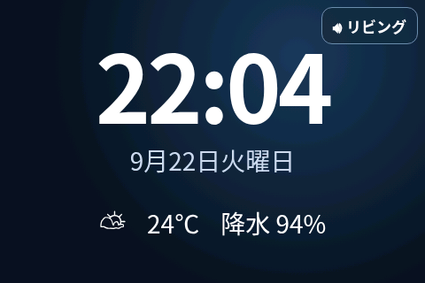
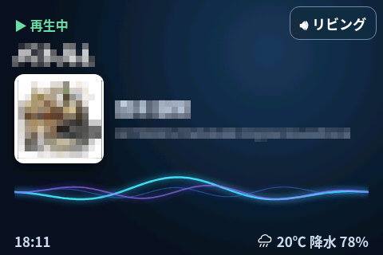

# Raspberry Pi Home Signage

Raspberry Piと3.5インチLCDで、時計・天気とGoogle Homeの再生中楽曲を表示するホームサイネージです。

- 通常時: 大きな時計、日付、現在気温、今日の最大降水確率
- Google Homeの再生中: 曲名、アーティスト、アルバム、ジャケットへ自動切替
- 再生画面: 480×320 LCD向けレイアウト、長い曲名の自動横スクロール、Waveビジュアライザー、時刻・天気を表示
- 天気: Open-Meteo（APIキー不要、15分更新）、天候に応じたSVGアイコン表示
- 曲情報: PyChromecast（既定5秒更新）
- 右上の機器名をタッチしてGoogle Homeを変更（選択値は再起動後も維持）

## スクリーンショット

### 時計・天気表示



### 音楽再生中（Google Home）



## 1. Piへ配置

リポジトリをホームディレクトリの `raspi-signage` に配置します。

```bash
cd ~/raspi-signage
sudo apt update
sudo apt install -y python3-venv chromium fonts-noto-cjk
python3 -m venv .venv
.venv/bin/pip install -r requirements.txt
cp .env.example .env
```

`.env` の `CAST_NAME`、`LATITUDE`、`LONGITUDE` を環境に合わせて設定してください。`POLL_SECONDS` はGoogle Homeの状態確認間隔（秒）です。

`CAST_NAME` は画面右上の機器選択から変更することもできます。`LATITUDE` / `LONGITUDE` が空欄の場合、天気情報は取得しません。

## 2. 手動テスト

```bash
cd ~/raspi-signage
.venv/bin/python app.py
```

同じPiのブラウザで `http://127.0.0.1:8080` を開きます。終了は `Ctrl+C` です。

## 3. バックエンドを自動起動

同梱の `raspi-signage.service` は `__USER__` と `__HOME__` をプレースホルダーにしています。現在のユーザー用のserviceファイルを生成してインストールします。

```bash
cd ~/raspi-signage
sed -e "s|__USER__|$USER|g" -e "s|__HOME__|$HOME|g" \
  raspi-signage.service | sudo tee /etc/systemd/system/raspi-signage.service >/dev/null
sudo systemctl daemon-reload
sudo systemctl enable --now raspi-signage
systemctl status raspi-signage --no-pager
```

ログ確認:

```bash
journalctl -u raspi-signage -f
```

## 4. Chromiumキオスクと画面スリープ防止

デスクトップへログインするユーザーで実行します。

```bash
mkdir -p ~/.config/autostart
cp kiosk.desktop ~/.config/autostart/
cp disable-dpms.desktop ~/.config/autostart/
```

`kiosk.desktop` は `$HOME` を使用するため、ユーザー名をファイル内に固定していません。

`disable-dpms.desktop` はX11のスクリーンセーバーとDPMSを無効化します。これを設定しない場合、環境によっては無操作状態が続くと表示更新が止まったように見えることがあります。

その後、Piを再起動します。

```bash
sudo reboot
```

再起動後、DPMS無効化を確認できます。

```bash
DISPLAY=:0 xset q
```

次の状態なら正常です。

```text
Screen Saver:
  timeout: 0

DPMS (Display Power Management Signaling):
  DPMS is Disabled
```

### SSHから表示を再読み込み

フロントエンドの変更を反映する場合など、SSHからChromiumキオスクを再起動できます。

```bash
cd ~/raspi-signage
./reload-display.sh
```

このスクリプトはChromiumを終了し、サイネージ用プロファイルを使用してキオスクモードで再起動します。

バックエンドのみを再起動する場合は次を使用します。

```bash
sudo systemctl restart raspi-signage
```

`systemctl restart` はFlaskバックエンドのみを再起動し、Chromiumは再起動しません。

## ローカル設定とGit

以下はローカル環境固有のためGit管理対象外です。

- `.env`
- `settings.json`
- `.venv/`
- `__pycache__/`
- `*.before-*`
- `*.bak`
- `dev-work/`

初回セットアップでは `.env.example` を `.env` にコピーして使用してください。実際の緯度・経度、Google Home名、認証情報などの環境固有情報はコミットしないでください。

## よくある問題

- 曲名が出ない: PiとGoogle Homeが同一LANか確認し、`.env` の機器名または画面右上の選択を確認します。
- 天気が出ない: `.env` の `LATITUDE` と `LONGITUDE` が設定されているか確認します。
- 画面更新が無操作後に止まる: `DISPLAY=:0 xset q` で `timeout: 0` と `DPMS is Disabled` を確認します。
- バックエンド確認: `curl http://127.0.0.1:8080/api/status` と `systemctl status raspi-signage` を確認します。
- Chromiumのコマンドがない: `command -v chromium chromium-browser` を確認し、`kiosk.desktop` のコマンド名を実環境に合わせます。

まず手動テストまで行い、表示とGoogle Home検出が確認できてから自動起動を設定してください。

## 動作確認環境

v0.3 は以下の環境で動作確認しています。

- Raspberry Pi 4
- Raspberry Pi OS 64-bit（Debian GNU/Linux 13 / trixie ベース）
- Chromium（キオスクモード）
- Python 3
- MHS-3.5 3.5インチLCD
  - ILI9486
  - 480×320
  - `dtoverlay=tft35a:rotate=90`
- Google Cast / Google Home デバイス

以下の動作を確認しています。

- 起動時のChromiumキオスク自動起動
- 時計の表示・更新
- Open-Meteoによる天気表示
- SVG天気アイコンの表示
- Google Castデバイスの検出
- 再生中の曲名、アーティスト、アルバム、ジャケットの表示
- 長い曲名の自動横スクロール
- 再生画面のWaveビジュアライザー
- 再生画面の時刻・天気表示
- `reload-display.sh` によるChromiumキオスクの再起動
- X11のスクリーンセーバー / DPMSを無効化した状態での連続表示

他のRaspberry Piモデル、ディスプレイ、OSバージョンでの動作は未確認です。

## AIの利用について

このプロジェクトでは、コードやドキュメントの作成・修正にAIを利用しています。

## 外部サービス

天気情報の取得には [Open-Meteo](https://open-meteo.com/) を使用しています。

Weather data by Open-Meteo, licensed under CC BY 4.0.

## ライセンス

MITライセンスです。[LICENSE](LICENSE) を参照してください。
